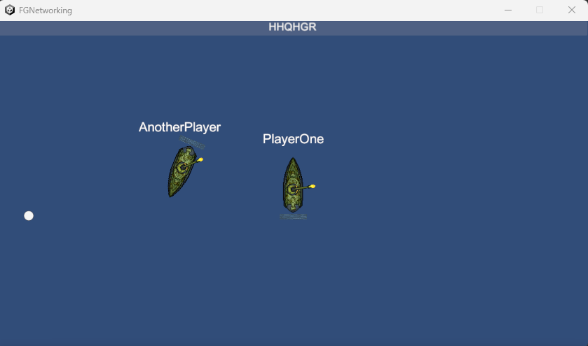

# Assignment Collection, Network Programming Course - Anton Hedlund
This is a collection of assignments, implemented within a rudimentary game prototype for a network programming course at FutureGames. There are 14 various tasks, not all need to be implemented. I will only list the ones I have solved.

## Task 1. Overhead Names (1pt)
A locally managed TextMesh which [displays players' usernames](Assets/Scripts/Player/UserNameDisplay.cs) above their ships. The name displayed is assigned by the server using a NetworkVariable<FixedString64Bytes>.

