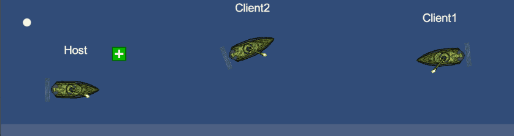

# Assignment Collection, Network Programming Course - Anton Hedlund
This is a collection of assignments, implemented within a rudimentary game prototype for a network programming course at FutureGames. There are 14 various tasks, not all need to be implemented. I will only list the ones I have solved.

## Task 1. Overhead Names (1pt)
A locally managed TextMesh which [displays players' usernames](Assets/Scripts/Player/UserNameDisplay.cs) above their ships. The name displayed is assigned by the server using a NetworkVariable<FixedString64Bytes>.

## Task 2. Health Packs (1pt)
A pre-placed, non-respawnable [health pack](Assets/Scripts/Mines/HealthPack.cs), with a server-managed trigger that [restores HP](Assets/Scripts/Player/Health.cs#L26-L30). 

## Task 5. Shot Timer (1pt)
A shot cooldown managed by server. 

The previous solution allowed the client to make shooting RPC's to the server at any desired speed. [My new solution](Assets/Scripts/Player/FiringAction.cs) uses an _isShooting bool, managed by the owning client, which the server reads to fire actual bullets. The owning client makes local predictive shots, but it is the server's cooldown timer that determines actual outcomes.

## Task 7. Cheat Detection (4pts)
Since movement is client authoritative, this task implements cheating protection for clients teleporting. For the sake of testing the functionality, the Space bar has been bound to perform a teleport illegally.

This [cheating protection](Assets/Scripts/Player/PlayerController.cs#L115-L148) is implemented by letting the server keep track of the last known change in the player's position, as well as the time when that change happened. Whenever the clients sends a new position, the server makes sure the distance between the old and new position is travelable by using regular movement in that time. When a client is caught cheating, we kick them from the serverManager or hostManager.

I also added a [ServerMessageUI](Assets/Scripts/UI/ServerMessageUI.cs) object, where the server can push messages to be queued for display for all players. 
